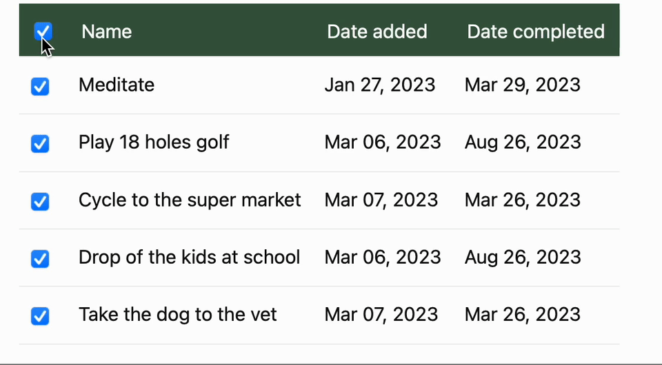

# Django Crispy TableSelect
[](https://github.com/techonomydev/django-tableselect/actions/workflows/ci.yml)

*Note:* this package is under heavy development and currently in proof-of-concept phase.

Crispy layout object for selecting rows in a [django-tables2](https://github.com/jieter/django-tables2/) data table.

<center>
    
</center>

## Todo list

- [ ] Write documentation (d'oh)
- [ ] Publish to PyPI
- [ ] Add checkbox in table header to select/de-select all rows at once.
- [ ] Add tests
- [ ] Audit accessibility

## Development setup

### Requirements
- At least python 3.9 (pyenv managed recommended)


### Install the django app with poetry
```bash
pyenv virtualenv 3.9 django-tableselect  # or your alternative to create a venv
pyenv activate django-tableselect
pip install poetry
make install

# Optional, when you're not creating the virtualenv yourself poetry will do it for you.
# You can activate the poetry venv like so:
source $(poetry env info --path)/bin/activate
```

### Linting
`flake8-black` and `flake8-isort` are installed and configured
```bash
make lint
```

### Formatting
`black` and `isort` are configured
```bash
make format
```


### Test
Pytest with coverage is default enabled
```bash
make test
```

### Run the django development server (sandbox)
First run the migrations:
```bash
make migrate
```

Now create a superuser:
```bash
sandbox/manage.py createsuperuser
```

Finally run the django dev server:
```bash
sandbox/manage.py runserver
```

You can now go to the django admin site: http://localhost:8000/admin
